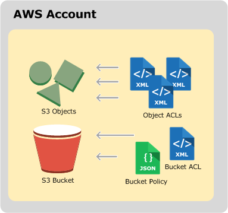
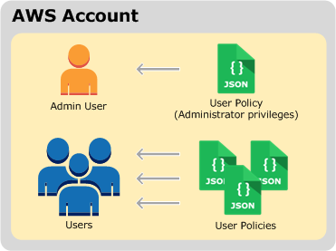

# AWS S3

### Conceptions

#### Bucket

存储桶是 Amazon S3 中用于存储对象的容器。

存储桶有以下几种用途：
- 组织最高等级的 Amazon S3命名空间 （有对应的URL）
- 识别负责存储和数据传输费用的账户
- 在访问控制中发挥作用以及用作使用率报告的汇总单位。

存储桶的属性：
- name
- location

子资源：
- lifecycle： 存储生命周期配置信息
- website：为网站托管配置存储桶时存储网站配置信息
- versioning：存储版本控制配置
- policy 和 acl（访问控制列表）： 存储存储桶的访问权限信息
- cors（跨源资源共享）： 支持配置存储桶以允许跨源请求
- logging： 使您能够请求 Amazon S3 保存存储桶访问日志

存储桶的操作：
参见 http://docs.aws.amazon.com/zh_cn/AmazonS3/latest/API/RESTBucketOps.html

#### Object

对象是 Amazon S3 中存储的基本实体。
对象由对象数据和元数据组成。数据部分对Amazon S3不透明。
元数据是一组描述对象的名称-值对。其中包括一些默认元数据（如上次修改日期）和标准 HTTP 元数据（如 Content-Type）。可以在存储对象时指定自定义元数据。

在存储桶中，对象将由密钥（名称）和版本 ID 进行唯一地标识。

属性：
- name
- version id

子资源：
- acl ： 存储对象访问权限列表
- restore ： 支持临时还原存档对象

操作：
参见 http://docs.aws.amazon.com/zh_cn/AmazonS3/latest/API/RESTObjectOps.html

#### multipart

- uploadId
- partId

### 一致性

一致性原则：S3大的原则上保证最终一致性。
只保证单一密钥更新的原子性。
不支持数据元锁定。同时对同一密钥的两个put，以最新时间戳请求为准。

### 安全性

#### 账户、用户鉴权

区分账户和用户。

AWS根账户，持有密钥自己算签名，在rest request中携带。
根账户可以创建IAM组合IAM用户，IAM用户属于IAM组。IAM组用于简化一组IAM用户的权限设置。
IAM用户拥有自己的密钥，也需要在rest request中携带签名。

签名需要携带在HTTP中 `Authorization: AWS AWSAccessKeyId:Signature` 供AWS校验。

IAM用户可以使用临时安全证书（临时访问密钥和安全令牌）供短暂使用；
使用临时安全证书签署请求必须通过添加 `x-amz-security-token`标头将相应的安全令牌包含在请求中。使用 AWS Security Token Service API 获取临时安全证书时，响应包含临时安全证书和会话令牌。向 Amazon S3 发送请求时，可以在 x-amz-security-token 标头中提供会话令牌值。

用户安全鉴权通过后，对S3进行某项操作，还要受到Bucket Policy, Bucket ACL以及对象ACL的鉴权。

#### 操作鉴权

##### 资源拥有者
用于创建存储桶和对象的 AWS 账户属于资源拥有者！
如果您在 AWS 账户中创建了一个 AWS Identity and Access Management (IAM) 用户，您的 AWS 账户就是父级拥有者。如果该 IAM 用户上传一个对象，则该用户所属的父账户拥有该对象。
存储桶拥有者可以向其他 AWS 账户（或其他账户中的用户）授予上传对象的跨账户权限。在这种情况下，上传对象的 AWS 账户拥有这些对象。存储桶拥有者对其他账户拥有的对象没有权限，以下情况除外：
账单由存储桶拥有者支付。存储桶拥有者可以拒绝对任何对象的访问，或删除存储桶中的任何对象，而无论它们的拥有者是谁。
存储桶拥有者可以存档任何对象或还原存档对象，而无论它们的拥有者是谁。存档是指用于存储对象的存储类。

##### 策略类型

Amazon S3 提供的访问策略选项大致可分为基于资源的策略和用户策略两类。将策略与 用户 或者 资源 相关联。

- 附加到资源（存储桶和对象）的访问策略称为基于资源的策略。例如，存储桶策略和访问控制列表 (ACL) 就是基于资源的策略。

- 将访问策略附加到您账户中的用户，这些策略称为用户策略。IAM用户必须拥有两种权限：一种权限来自其父账户，另一种权限来自拥有该用户要访问的资源的 AWS 账户。这类似于一个孩子想要玩别人的玩具。在这种情况下，这个孩子必须征得家长和玩具主人的同意才能玩这个玩具。

您可以选择使用基于资源的策略、用户策略或这些策略的某种组合来管理您的 Amazon S3 资源权限。

组合不同的策略类型，主要需要考虑3个决策点：
- 谁？
- 哪些资源？
- 操作？

ACL: XML格式，Owner, Grantee, Permission，基本读写权限
Bucket Policy： JSON格式，补充或者覆盖基于Bucket的ACL权限。Resouce， Action
User Policy: JSON格式，和Bucket Policy格式同。直接授权给指定用户

ACL 仅支持一组有限的权限（我能授予哪些许可？），其中并不包括所有 Amazon S3 权限。例如，使用 ACL 不能授予对存储桶子资源的权限。（ACL与子资源功能正交）

虽然存储桶和用户策略都支持授予所有 Amazon S3 操作权限，但用户策略是用来管理您账户中用户的权限的。对于其他 AWS 账户或其他账户中用户的跨账户权限，则必须使用存储桶策略。

#### 授权过程

##### 用户权限授权接口

创建用户，将用户添加到组的时候授予权限

##### 资源权限授权接口

Bucket Policy，ACL， Object ACL显式添加修改删除

ACL可以在创建的同时携带请求到一个rest中？
Policy呢？

#### 鉴权过程

首先进行身份校验。由S3外部进行校验。接下来由S3进行操作鉴权。

当Amazon S3收到请求（例如，存储桶或对象操作）时，它首先验证请求者是否拥有必要的权限。
Amazon S3 对所有相关访问策略、用户策略和基于资源的策略（存储桶策略、存储桶 ACL、对象 ACL）进行评估，以决定是否对该请求进行授权。

具体过程：
- 在运行时将所有相关访问策略（用户策略、存储桶策略、ACL）转换为一组策略以进行评估
- 通过以下步骤评估生成的策略集。在每个步骤中，Amazon S3都会基于特定上下文机构来评估上下文中的策略子集
    - 用户上下文：在用户上下文中，用户所属的父账户是上下文机构
    - 存储桶上下文：在存储桶上下文中，Amazon S3 评估拥有该存储桶的 AWS 账户所拥有的策略
    - 对象上下文：如果请求是针对对象发出的，则 Amazon S3 对由对象拥有者拥有的策略子集进行评估

#### 设计考量

S3将鉴权单独做一个服务，与AWS的IAM交互。对于任意请求，首先由鉴权服务进行处理，判断用户策略和资源策略。鉴权失败直接回错误，鉴权成功后由内部具体feature服务进行处理。

对于资源的操作权限配置修改都由此服务进行，保存资源的policy和acl信息。问题：

- 需要判断资源是否存在。
- 需要和IAM通信。
- 需要知道鉴权成功后将req如何派发
- 是否rest request接收者需要负责回复response

## 功能

### 顶层功能

- list all buckets:
    + request : no parameters
    + response: owner(id, display name), bucket(name, createDate)

### 独立的bucket功能

#### summary

resource      | put          | get/head       | delete   | list
--------------|--------------|----------------|----------------
bucket        | yes          | head           | yes      | yes
location      | no           | yes            | no       | no
acl           | yes          | yes            | no       | no
logging(beta) | yes          | yes            | no       | no
analytics     | yes          | yes            | yes      | yes
acceleration  | yes          | yes            | no       | no
cors          | yes          | yes            | yes      | no
inventory     | yes          | yes            | yes      | yes
lifecycle     | yes          | yes            | yes      | no
metrics       | yes          | yes            | yes      | yes
notification  | yes          | yes            | no       | no
policy        | yes          | yes            | yes      | no
replication   | yes          | yes            | yes      | no
requestPayment| yes          | yes            | no       | no
tagging       | yes          | yes            | yes      | no
versioning    | yes          | yes            | no       | no
website       | yes          | yes            | yes      | no
versions      | no           | yes(query param)| no      | no
list objects  | no           | yes(query param)| no      | no
multipart uploads | no       | yes            | no       | yes

#### put bucket

- request：bucket name，region，ACL
- response：OK/FAIL

#### head bucket

- request: bucket name
- response: OK/FAIL

#### put bucket acl

- request: bucket name, acl (canned acl or specified acl)
- response: OK/FAIL

#### get bucket acl
- request: bucket name
- response: acl

#### get bucket location
- request: bucket name
- response: location

#### delete bucket
- request: bucket name
- response: OK/FAIL
- constraint: must delete all objects and version and delete marker before

---
[notice] Logging functionality is currently in beta

#### put bucket logging
- request: bucket name, enable/disble logging, assign priority to specified user
- response: OK/FAIL

- implement notice: should spy the every request and responce detail, time order stream and store

#### get bucket logging
- request: bucket name
- response: logging status

---

#### put bucket analytics
- request: bucket name, analytics id, configuration in request body
- response: OK/FAIL

- implement notice: need spy the object change, time order stream and store
- generate <csv> file to store in the target bucket. max 1000 configurations.
- one configuration: prefix|tag, target bucket, ...

#### get bucket analytics
- request: bucket name, analytics id
- response: analytics configuration

#### delete bucket analytics
- request: bucket name, analytics id
- response: OK/FAIL

#### list bucket analytics
- request: bucket name
- response: analytics configurations

---

#### put bucket cors
- request: bucket name, cors configurations
- response: OK/FAIL

- implement notice: used for client browser to send `option` for determining if it can send an actual request with the specific origin, HTTP method, and headers for a object.

#### get bucket cors
- request: bucket name
- response: cors configuations

#### delete bucket cors
- request: bucket name, 
- response: OK/FAIL

---

#### put bucket inventory
- request: bucket name, inventory id, invertory configurations
- response: OK/FAIL

- implement notice: up to 1,000 inventory configurations per bucket
- generates inventories of the objects in the bucket on a daily or weekly basis and the results are published to a flat file
- can also configure what object metadata to include and whether to inventory all object versions or only current versions
- The inventory list provides eventual consistency for PUTs of both new objects and overwrites, and DELETEs.

#### get bucket inventory
- request: bucket name, inventory id
- response: inventory configurations

#### delete bucket inventory
- request: bucket name, inventory id
- response: OK/FAIL

#### list bucket inventory
- request: bucket name
- response: all inventory configurations of the bucket

---

#### put bucket lifecycle
- request: bucket name , rules for lifecycle
- response: OK/FAIL

- specify the lifecycle configuration in request body including filters can be based on key name prefix, object tags, or combination of both. Status whether rule is in effect. One or more lifecycle transition and expiration actions that you want Amazon S3 to perform on the objects identified by the filter.

- should known the object meta data: create time, not current time...

#### get bucket lifecycle
- request: bucket name
- response: lifecycle configurations

#### delete bucket lifecycle
- request: bucket name
- response: OK/FAIL

- implement notice: remove the running lifecycle task

---

#### put bucket metrics
- request : bucket name, metrics id, metrics configurations
- response: OK/FAIL

#### get bucket metrics
- request : bucket name, id
- response: metrics configurations

#### delete bucket metrics
- request : bucket name, id
- response: OK/FAIL

#### list bucket metrics
- request : bucket name
- response: all metrics configurations of the bucket

---

#### put bucket notification
- request : bucket name, notification configurations
- response: OK/FAIL

- notification event: s3:ObjectCreated:*, s3:ObjectCreated:Put, s3:ObjectCreated:Post, s3:ObjectCreated:Copy, s3:ObjectCreated:CompleteMultipartUpload, s3:ReducedRedundancyLostObject

- notification target: SNS, SQS, LAMBDA

#### get bucket notification
- request : bucket name
- response: notification configurations

---

#### put bucket policy
- request: bucket name, policy configuration (json)
- response: OK/FAIL

- implement notice: related to all policy of other sub-resources???

#### get bucket policy
- request: bucket name
- response: policy configuration (json)

#### delete bucket policy
- request: bucket name
- response: OK/FAIL

---

#### put bucket replication
- request: bucket name, replication configuration (xml)
- response: OK/FAIL

- execute the replication
- mark the object replication state;
- retrieve the object replication state(x-amz-replication-status = PENDING|COMPLETED|FAILED) for GET or HEAD object request
- replicate the tags of objects

#### get bucket replication
- request: bucket name
- response: replication configuration (xml)

#### delete bucket replication
- request: bucket name
- response: OK/FAIL

--- 

#### put bucket requestPayment
- request: bucket name, requestPayment configurations
- response: OK/FAIL

- specify that the person requesting the download will be charged for the download
- a feature related to bill

#### get bucket requestPayment
- request: bucket name
- response: requestPayment configurations

---

#### put bucket tagging
- request: bucket name, tagging setting
- response: OK/FAIL

- Use tags to organize your AWS bill to reflect your own cost structure
- related with bill

#### get bucket tagging
- request: bucket name
- response: tagging setting

#### delete bucket tagging
- request: bucket name
- response: OK/FAIL

---

#### put bucket versioning
- request: bucket name, versioning state(enabled, suspended)
- response: OK/FAIL

- when put, get, delete a object, should execute versioning operation

#### get bucket versioning
- request: bucket name
- response: versioning state(enabled, suspended)

---

#### put bucket website
- request : bucket name, website configurations
- response: OK/FAIL

-  file name of the index document and any redirect rules
-  related to the route service

#### get bucket website
- request : bucket name
- response: website configurations

#### delete bucket website
- request : bucket name
- response: OK/FAIL

---

#### get bucket object versions
- request: bucket name, `/versions?<query>`
- response: all matched objects with verson and detail meta info

#### get bucket object versions 2
- request: bucket name, `GET /?list-type=2?<query>`
- response: all matched objects with verson and detail meta info

---

#### get multipart upload
- request: bucket name
- response: all matched multipart upload info

- multipart upload is a multipart upload that has been initiated using the Initiate Multipart Upload request, but has not yet been completed or aborted.

- related with the multipart upload process

### object功能

#### put object
- request: bucket name, object name,
    - Storage Class
    - acl
    - meta
    - taggings
    - website​-redirect-location
    - Server-Side Encryption
    - 
- response:
    - version
    - expire date (lifecycle)
    - encryption algorithm and MD5 of the encryption key

- implement notice:
    - related much sub-resources when putting
    - related the lifecycle and versionning and website features with bucket

#### post object
- almost same as put operation except the http request format

#### head object
- request: bucket name, object name, other query condition params
- response:
    - storage class
    - version id
    - expiration (date)
    - meta
    - tagging
    - replication-status
    - restore status
    - encryption
- implement notice:
    - related with lifecycle, replication and resore processes

#### get object
- request: same with head operation
- response: adding below on the head operation
    - delete-marker : true | false 
    - website​-redirect-location 
    - have permission to read object tags, return tag count
- implement notice:
    - related the current object state: is in the GLACIER storage?
    - sub-resource whether returned in response associated with the permission

#### delete object
- request: bucket name, object name
- response:
    - version id
    - delete marker: true | false
- implement notice:
    -  object versioning state

#### delete multiple objects
- request: bucket name, post the object list(key, version id)
- response: every result (version id, delete marker, code, message ...)

---

#### put object copy
- request: target object name, target bucket
    - source: bucket name, object name
    - same as put a new object: storage class, acl...
- response: result, etag, date of last modified

---

#### post object restore
- request: bucket name, object name, version id
    - Days
    - Ties: Expedited | Standard | Bulk
- response: in progress?
- implement notice: lifecycle expire date override the specified day

---

#### put tagging
#### get tagging
#### delete tagging
- could specify the version id

---

#### put acl
#### get acl
#### delete acl
- could specify the version id

---

#### get object torrent
- request: bucket name, object name
- response: torrent file

---

#### multipart

##### initiate upload
- request: object name
    - meta
    - storage class
    - website-redirect
    - encryption
    - acl
- response:  UploadId
    - abort-date: according lifecycle rule 

##### upload part
- request: upload id, part number(1-10000)

##### upload part copy
- request: upload id,  x-amz-copy-source, x-amz-copy-source-range

##### list part
- request: upload id, condition
- response: detail info by every part

##### aborts multipart upload
- request : upload id
- response: result. 
- if any part uploads are currently in progress, those part uploads might or might not succeed. As a result, it might be necessary to abort a given multipart upload multiple times in order to completely free all storage consumed by all parts. To verify that all parts have been removed, so you don't get charged for the part storage, you should call the List Parts operation and ensure the parts list is empty.

##### complete multipart upload
- request: upload id, part numbers and etags list
- response: new object version id, expiration, encryption, location, bucket, key, etag
- Upon receiving this request, Amazon S3 concatenates all the parts in ascending order by part number to create a new object. In the Complete Multipart Upload request, you must provide the parts list. You must ensure the parts list is complete, this operation concatenates the parts you provide in the list. For each part in the list, you must provide the part number and the ETag header value, returned after that part was uploaded.

## 设计

### 设计原则

分类服务：
- 基本服务
- 特性服务
- 统计性服务
- 审计服务

一个服务内部：
- 支持的API
- 封装的数据
- 内部算法
- 发布的Event，或者需要和别的服务进行的交互

服务部署：
- 如何新增
- 如何注册、被发现
- 如何均衡
- 如何移除
- 如何升级

### 服务关系

### 基础设施
